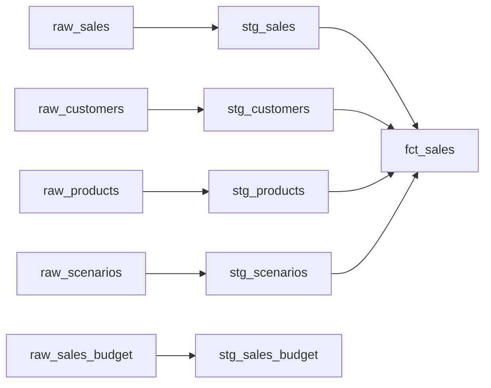

# dbt Sales Analytics

Rebuild of the sales slice of a production Power BI monolith, built to close a real operational gap: forecast and actuals data drifted apart over time with no way to trace when, why, or by whom — differences surfaced only when the sales team asked pointed questions, and the answer lived in scattered email threads instead of in the data itself. This project demonstrates the fix: every transformation tested and documented, so drift is caught by a failing test and explained by a commit message, not an inbox search.

## The problem

The source ERP holds sales data at two grains: a general-ledger summary (aggregated to posting account) and a SKU/order-line transactional detail feed. This project rebuilds the SKU-level slice only — GL reconciliation is a separate, already-diagnosed piece of work outside this project's scope.

The real pain in the SKU-level data wasn't structural — it was a lack of traceability. Actuals (the real invoice price by account) was the source of truth; forecast carried its own unit price and cost assumptions that were meant to track actuals but regularly drifted, because nothing systematically checked and nothing documented when or why an assumption had changed. When the sales team asked why a number looked off, the answer usually existed — somewhere in an email thread — but there was no single place to see what had changed, when, or why. That's the gap this project closes: tests catch drift automatically, and every change to a model or assumption is a documented, versioned commit instead of a thread to dig back through.

A structural audit separately flagged **Budget** and **Plan** as sharing the same account-level grain and near-identical columns. In practice this wasn't painful to work with day to day — but it's an unconformed structure, and collapsing them into one fact with a scenario dimension is a cleaner pattern that also simplifies measure authoring: one row-level scenario tag instead of parallel measure sets per table. **Actuals** (order-line grain) and **Forecast** (a periodic snapshot loaded weekly against a locked monthly baseline) are structurally distinct from Budget/Plan and from each other — correctly kept separate, not folded into the same fix.

## The solution



- **`fct_sales`** — one row per order line item per scenario. Grain: `sop_number` + `sop_line` + `scenario_code`, enforced with a test, not just documented. Currently `ACT` only, designed to extend to future actuals-side scenarios without a schema change.
- **`stg_sales_budget`** — a separate staging model at product/customer/month grain, reflecting that budget genuinely doesn't share actuals' transactional grain. Not unioned into `fct_sales` — a future rollup layer will conform both to a common comparison grain.
- Four conformed dimensions: `stg_customers`, `stg_products`, `stg_scenarios`, plus `scenario_code` designed to carry future scenarios.

## Design decisions

**Every change is traceable, not buried in an inbox.** Commit-per-model with a message capturing intent means "what changed and why" is a `git log`, not an email search. This is the direct fix for the drift problem described above — the process gap wasn't a lack of care, it was a lack of tooling that made traceability easy.

**Grain is tested, not just stated.** Every model has an explicit grain enforced with `dbt_utils.unique_combination_of_columns`. One grain assumption was wrong on first pass — a column that looked like a row counter turned out to be the real line identifier once checked against raw data directly, which is now the standard for resolving grain questions on this project: check the data, don't guess from column names.

**Staging stays source-conformed, even for scenarios that will eventually be compared.** Actuals, budget, and (eventually) plan don't share a grain — actuals is transactional (order/line), budget and plan are planning-level (product/customer/month) — so forcing them into one shared structure at staging would repeat the exact anti-pattern this project exists to fix. Each gets its own seed and staging model, mirroring how they actually arrive as distinct real submissions. Conforming them into one comparable structure is a mart-layer job, done later in a rollup — not by merging raw sources upfront.

**Referential integrity is enforced, not assumed.** Every foreign key in `fct_sales` carries a `relationships` test against its dimension, in addition to `not_null`. This is the piece that was silently missing in the original monolith.

**Naming reflects what a model actually is.** `stg_sales_actuals` was renamed to `stg_sales` once budget was split out — the model no longer holds only actuals, so the name changed to match. dbt community conventions (`stg_`, `fct_`) used throughout for portfolio legibility, even though the source system's own naming (Power BI's `ft_`/`dt_` prefixes) is different.

## Tech stack

- **dbt Core** + **DuckDB** — local development, zero infrastructure cost
- **dbt_utils** — grain enforcement (`unique_combination_of_columns`)

## How to run

```bash
git clone https://github.com/raceonc/dbt-sales-analytics.git
cd dbt-sales-analytics
python3 -m venv .venv && source .venv/bin/activate
pip install dbt-core dbt-duckdb
dbt deps
dbt seed
dbt build
dbt docs generate && dbt docs serve
```

## Testing

Generic tests (`not_null`, `unique`, `accepted_values`) across every model, plus:
- **Grain enforcement** — `dbt_utils.unique_combination_of_columns` on `stg_sales`, `stg_sales_budget`, `fct_sales`
- **Referential integrity** — `relationships` tests on every foreign key in `fct_sales`

**26/26 tests passing.**

## Project structure

```
dbt-sales-analytics/
├── seeds/
│   ├── raw_sales.csv
│   ├── raw_sales_budget.csv
│   ├── raw_customers.csv
│   ├── raw_products.csv
│   └── raw_scenarios.csv
├── models/
│   ├── staging/
│   │   ├── stg_sales.sql
│   │   ├── stg_sales_budget.sql
│   │   ├── stg_customers.sql
│   │   ├── stg_products.sql
│   │   ├── stg_scenarios.sql
│   │   └── schema.yml
│   └── marts/
│       ├── fct_sales.sql
│       └── schema.yml
├── packages.yml
└── dbt_project.yml
```

## What's next

- **Forecast as a periodic snapshot fact** — weekly loads compared against a locked monthly baseline, for IBP-style variance tracking. Structurally different from the transaction-grain `fct_sales` (periodic snapshot vs. transaction fact), so it's a separate build, not an extension of the existing model.
- **Forecast-vs-actuals variance model** — joins the locked forecast to realized actuals once a month closes and computes price/cost drift automatically. This is the model that proves the traceability claim at the top of this README — highest priority remaining piece.
- **`stg_sales_plan`** — mirrors `stg_sales_budget`'s grain and structure from its own `raw_sales_plan` seed. Kept separate at staging, same as budget — conforming happens downstream.
- **Scenario comparison rollup mart** — aggregates actuals up to product/customer/month grain and unions Budget + Plan (each already at that grain) into one comparable structure, with `scenario_code` finally spanning `ACT`/`BUD`/`PL`. This is where staging becomes business-conformed.
- **CI** — GitHub Actions running `dbt build` on PRs, dev/prod target separation.