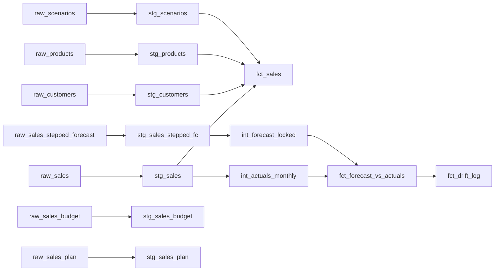

# dbt Sales Analytics

Rebuild of the sales slice of a production Power BI monolith, built to close a real operational gap: forecast and actuals data drifted apart over time with no way to trace when, why, or by whom — differences surfaced only when the sales team asked pointed questions, and the answer lived in scattered email threads instead of in the data itself. This project demonstrates the fix: every transformation tested and documented, drift computed and logged as a dated, auditable fact — caught by a failing test and explained by a commit message, not an inbox search.

## The problem

The source ERP holds sales data at two grains: a general-ledger summary (aggregated to posting account) and a SKU/order-line transactional detail feed. This project rebuilds the SKU-level slice only — GL reconciliation is a separate, already-diagnosed piece of work outside this project's scope.

The real pain in the SKU-level data wasn't structural — it was a lack of traceability. Actuals (the real invoice price by account) was the source of truth; forecast carried its own unit price and cost assumptions that were meant to track actuals but regularly drifted, because nothing systematically checked and nothing documented when or why an assumption had changed. When the sales team asked why a number looked off, the answer usually existed — somewhere in an email thread — but there was no single place to see what had changed, when, or why. That's the gap this project closes: a variance model surfaces drift automatically, a drift log retains it as dated history, and every change to a model or assumption is a documented, versioned commit instead of a thread to dig back through.

A structural audit separately flagged **Budget** and **Plan** as sharing the same account-level grain and near-identical columns. In practice this wasn't painful to work with day to day — but it's an unconformed structure, and collapsing them into one fact with a scenario dimension is a cleaner pattern that also simplifies measure authoring: one row-level scenario tag instead of parallel measure sets per table. **Actuals** (order-line grain) and **Forecast** (a periodic snapshot loaded weekly against a locked monthly baseline) are structurally distinct from Budget/Plan and from each other — correctly kept separate, not folded into the same fix.

## The solution



**The conformed transaction fact**

- **`fct_sales`** — one row per order line item per scenario. Grain: `sop_number` + `sop_line` + `scenario_code`, enforced with a test, not just documented. Currently `ACT` only, designed to extend to future actuals-side scenarios without a schema change. Conformed to `stg_customers`, `stg_products`, `stg_scenarios` via left joins on unique-tested dimension keys.

**The forecast-vs-actuals pipeline (the part that proves the traceability claim)**

- **`stg_sales_stepped_fc`** — the forecast source as a periodic snapshot fact. Grain: `product_code` / `customer_code` / `snapshot_date` / `forecast_month`. Each weekly upload re-forecasts forward months; `is_locked` marks the committed consensus snapshot.
- **`int_actuals_monthly`** — actuals rolled from order-line to product/customer/month. Unit price and cost aren't additive, so effective values are quantity-weighted (total value / total quantity).
- **`int_forecast_locked`** — forecast deduped to the latest locked snapshot per product/customer/month, via `row_number()` + `qualify`. Multiple cycles lock the same month; this keeps the most recent lock.
- **`fct_forecast_vs_actuals`** — full outer join of the two, exposing qty / price / cost variance. Full outer, not inner: a forecast with no actual (a predicted sale that didn't land) and an actual with no forecast (a sale nobody saw coming) are both real variance cases, and an inner join would silently drop them.
- **`fct_drift_log`** — append-only, incremental log of price and cost drift, one row per product/customer/month, retained across periods. Each run appends any newly-closed month; history is never overwritten. This is what turns "the forecast was wrong" from a finger-pointing email into a dated, auditable fact.

**Planning-scenario staging**

- **`stg_sales_budget`** / **`stg_sales_plan`** — separate staging models at product/customer/month grain, reflecting that budget and plan genuinely don't share actuals' transactional grain. Not unioned into `fct_sales`; conforming them into a common comparison grain is a deferred mart-layer job (see below).

Four conformed dimensions back the facts: `stg_customers`, `stg_products`, `stg_scenarios`, with `scenario_code` designed to carry future scenarios.

## Design decisions

**Every change is traceable, not buried in an inbox.** Commit-per-model with a message capturing intent means "what changed and why" is a `git log`, not an email search. This is the direct fix for the drift problem described above — the process gap wasn't a lack of care, it was a lack of tooling that made traceability easy.

**Grain is tested, not just stated.** Every model has an explicit grain enforced with `dbt_utils.unique_combination_of_columns`. One grain assumption was wrong on first pass — a column that looked like a row counter turned out to be the real line identifier once checked against raw data directly, which is now the standard for resolving grain questions on this project: check the data, don't guess from column names.

**Drift is an immutable, append-only record.** `fct_drift_log` is incremental and never rewrites history — a closed month's logged drift is a fact that stays put. `is_incremental()` gates the append so each run only adds newly-closed months. (The obvious extension — reprocessing a restated month via bitemporal grain — is designed and deliberately deferred; see below.)

**Staging stays source-conformed, even for scenarios that will eventually be compared.** Actuals, budget, and plan don't share a grain — actuals is transactional (order/line), budget and plan are planning-level (product/customer/month) — so forcing them into one shared structure at staging would repeat the exact anti-pattern this project exists to fix. Each gets its own seed and staging model, mirroring how they actually arrive as distinct real submissions. Conforming them is a mart-layer job, not a merge of raw sources upfront.

**Referential integrity is enforced, not assumed.** Every foreign key carries a `relationships` test against its dimension, in addition to `not_null` — across `fct_sales` and the intermediate + variance models (`int_actuals_monthly`, `int_forecast_locked`, `fct_forecast_vs_actuals`). On the variance mart this does real work: its full outer join could otherwise carry a coalesced key that has no matching dimension row. This is the piece that was silently missing in the original monolith.

**Naming reflects what a model actually is.** `stg_sales_actuals` was renamed to `stg_sales` once budget was split out — the model no longer holds only actuals, so the name changed to match. dbt community conventions (`stg_`, `int_`, `fct_`) used throughout for portfolio legibility, even though the source system's own naming (Power BI's `ft_`/`dt_` prefixes) differs.

## Tech stack

- **dbt Core** + **DuckDB** — local development, zero infrastructure cost
- **dbt_utils** — grain enforcement (`unique_combination_of_columns`)
- **Incremental materialization** — append-only drift log
- **GitHub Actions** — CI running `dbt build` on every PR to `main`

## How to run

```bash
git clone https://github.com/raceonc/dbt-sales-analytics.git
cd dbt-sales-analytics
python3 -m venv .venv && source .venv/bin/activate
pip install dbt-core dbt-duckdb
dbt deps
dbt seed
dbt build
dbt docs generate && dbt docs serve
```

## Testing

**57 tests, all passing.** Coverage:

- **Grain enforcement** — `dbt_utils.unique_combination_of_columns` on every fact and every non-dimension staging model (`stg_sales`, `stg_sales_stepped_fc`, `stg_sales_budget`, `stg_sales_plan`, `fct_sales`, `fct_forecast_vs_actuals`, `fct_drift_log`, `int_actuals_monthly`, `int_forecast_locked`).
- **Referential integrity** — `relationships` tests on every foreign key across `fct_sales` and the intermediate + variance models, pointing to `stg_products` / `stg_customers` / `stg_scenarios`.
- **Generic tests** — `not_null`, `unique`, and `accepted_values` across staging and marts.

CI runs the full `dbt build` (models + tests) on every pull request to `main`.

## Project structure

```
dbt-sales-analytics/
├── .github/
│   └── workflows/
│       └── ci.yml
├── seeds/
│   ├── raw_sales.csv
│   ├── raw_sales_budget.csv
│   ├── raw_sales_plan.csv
│   ├── raw_sales_stepped_forecast.csv
│   ├── raw_customers.csv
│   ├── raw_products.csv
│   └── raw_scenario.csv
├── models/
│   ├── staging/
│   │   ├── stg_sales.sql
│   │   ├── stg_sales_stepped_fc.sql
│   │   ├── stg_sales_budget.sql
│   │   ├── stg_sales_plan.sql
│   │   ├── stg_customers.sql
│   │   ├── stg_products.sql
│   │   ├── stg_scenarios.sql
│   │   └── schema.yml
│   ├── intermediate/
│   │   ├── int_actuals_monthly.sql
│   │   ├── int_forecast_locked.sql
│   │   └── schema.yml
│   └── marts/
│       ├── fct_sales.sql
│       ├── fct_forecast_vs_actuals.sql
│       ├── fct_drift_log.sql
│       └── schema.yml
├── packages.yml
├── profiles.yml
└── dbt_project.yml
```

## Designed and deliberately deferred

These are worked out but intentionally out of scope for this build — noted here to show the design was considered, not overlooked:

- **Corrections-as-events on the drift log** — bitemporal grain (add `logged_at` alongside the business month) so a restated closed month is reprocessed as a new dated event rather than an overwrite, preserving "finance adjusted it, here's the proof."
- **`drift_current`** — a latest-per-grain projection over the append-only log, since "current" is a derived query, not a second stored table.
- **Authored annotations stream** — structured `adjustment_type` + free-text note, kept in a separate object from the immutable fact log to preserve provenance separation (computed facts vs human context).
- **Scenario-comparison rollup** — rolling budget/plan up to a common comparison grain. Deliberately not built: the full four-scenario side-by-side cube was scoped out to keep the story sharp on traceability rather than breadth.
